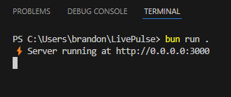
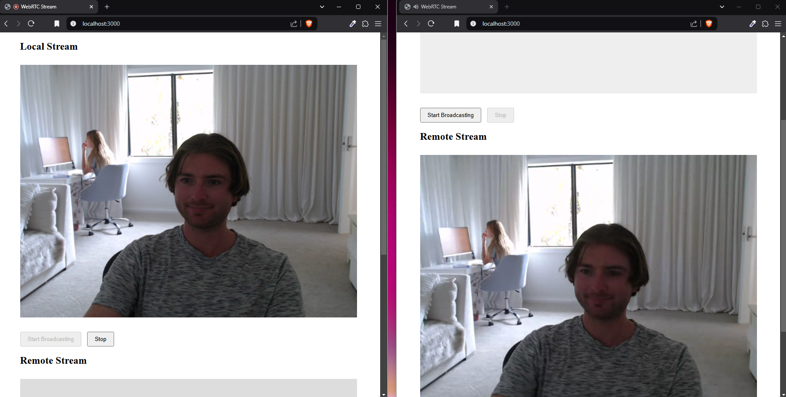

# LivePulse

This is a minimal example of how to create a LiveStream website, using:

- https://bun.sh (quickly run javascript code)
- https://developer.mozilla.org/en-US/docs/Web/API/WebSockets_API (communicate between clients)
- https://developer.mozilla.org/en-US/docs/Web/API/MediaStream (build the video stream)




# Getting started

To install dependencies:

```bash
bun install
```

To run:

```bash
bun run index.ts
```

This project was created using `bun init` in bun v1.1.42. [Bun](https://bun.sh) is a fast all-in-one JavaScript runtime.
